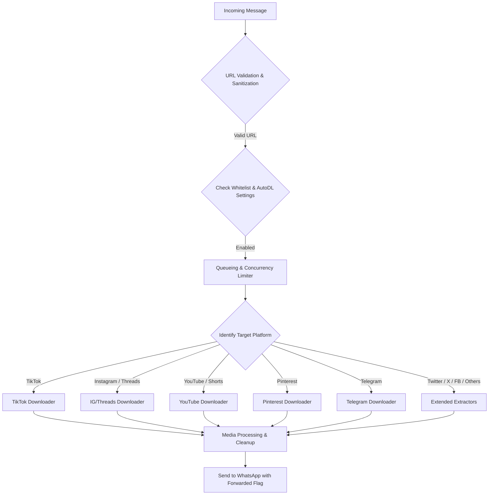

# 📋 Engineering Plan: Auto-Downloader (AutoDL) Feature Enhancement

## 1. 🔍 Current Implementation Overview

Based on analysis of the `razaeldotexe/waf` repository (`beta` branch/tag):
- **Database (`prisma/schema.prisma`)**: The `AutoDlSetting` SQLite model manages per-`jid` and per-`platform` configuration.
- **Core Engine (`src/utils/autodl.ts`)**:
  - Employs regex `/(https?:\/\/[^\s]+)/g` to detect incoming link patterns in chat messages.
  - Utilizes an in-memory cache `autoDlCache` to minimize database queries during live message processing.
  - Maps supported platforms to existing downloader tools:
    - TikTok (`tiktok.com`) $\rightarrow$ `tiktokdl` tool (via TikWM API + FFmpeg slideshow builder).
    - Instagram (`instagram.com`, `instagr.am`) $\rightarrow$ `ytdl` tool (via yt-dlp).
    - Pinterest (`pin.it`, `pinterest.com`) $\rightarrow$ `pinterestdl` tool.
    - YouTube (`youtube.com`, `youtu.be`) $\rightarrow$ `ytdl` tool (via yt-dlp).
    - Telegram (`t.me`) $\rightarrow$ `telegramdl` tool.
- **Command & Configuration Interface (`src/tools/autodl.ts`)**:
  - Commands: `.autodl <platform> <on/off>` / `.autodl all <on/off>` / `.autodl list`.
  - Access control: Group Admins/Owner in groups; Bot Owner only in private chats.
- **Message Hook (`src/handlers/message.ts`)**:
  - Inspects incoming messages, filters bot-generated outputs, and invokes `processAutoDl`.

---

## 2. ⚠️ Key Issues & Improvement Areas

1. **Regex & URL Sanitization**:
   - The current expression `/(https?:\/\/[^\s]+)/g` often captures trailing punctuation characters (e.g., `.`, `,`, `!`, `)`, `>`), causing extraction failures and HTTP 404 errors.
   - Additional social media domains (such as Threads `threads.net`, Facebook `facebook.com`/`fb.watch`, Twitter/X `x.com`/`twitter.com`, Spotify `spotify.com`) are not yet fully integrated into AutoDL routing.
2. **Instagram Media Handling**:
   - Currently routed through generic `ytdl` (yt-dlp). Multi-media carousels (mixed photos/videos) and stories require robust fallback mechanisms when yt-dlp encounters rate limits or authentication challenges.
3. **Concurrency & Resource Management**:
   - Multiple or concurrent URLs sent in rapid succession trigger parallel download pipelines without rate limiting, risking CPU/memory exhaustion on constrained environments (e.g., Termux/low-spec VPS).
4. **User Experience & Minimalism**:
   - Responses must remain clean, minimal, and non-intrusive for non-technical users (relying primarily on emoji reaction indicators `⏳`, `✅`, `❌` without noisy, verbose error logs).
5. **Granular Chat Control**:
   - Master chat-level toggle options are needed to complement individual platform toggles.

---

## 3. 🎯 Feature Enhancement Roadmap

### Phase 1: Robust URL Sanitization & Link Resolution
- [ ] Strip trailing punctuation and delimiters (e.g., `.,!?)>"'`) from extracted URLs.
- [ ] Expand canonical unshortening support for redirect domains (e.g., `vt.tiktok.com`, `vm.tiktok.com`, `youtu.be`, `pin.it`, `t.co`, `threads.net`).

### Phase 2: Platform Expansion & Media Support
- [ ] **Twitter / X (`x.com`, `twitter.com`)**: Add `x`/`twitter` platform handler.
- [ ] **Facebook / Reels (`fb.watch`, `facebook.com`)**: Add Facebook video downloader integration.
- [ ] **Threads (`threads.net`)**: Add Threads media downloader integration.
- [ ] **Instagram Carousel Support**: Ensure multi-slide posts (mixed images & videos) are completely processed without truncation.

### Phase 3: Performance Optimization & Queue Management
- [ ] Implement a lightweight per-chat download queue (concurrency cap: 1-2 simultaneous operations) to prevent process crashes.
- [ ] Message deduplication and loop prevention for quoted/edited messages.

### Phase 4: Automated Message Deletion System
- [ ] **Sender Link Auto-Deletion (Permission & Origin Logic)**:
  - **Upon Successful Download & Delivery**:
    - **Self-Triggered (`fromMe: true`)**: Delete sender message as **`for everyone`** (`sock.sendMessage(jid, { delete: msg.key })`).
    - **Other Users' Messages**:
      - **If Bot is Group Admin**: Delete message as **`for everyone`** (`for-all`).
      - **If Bot is NOT Admin**: Delete message locally for **`for me` (bot only)** via `chatModify` to avoid permission errors while maintaining a clean chat log.
  - **Upon Download Failure/Error**:
    - Retain the sender's link message so the user remains aware and can retry.
- [ ] **Downloaded Media Auto-Deletion Timers (For Everyone)**:
  - Since bot-delivered media messages are owned by the bot (`fromMe: true`), deletion is always executed as **`for everyone`**:
    - 🖼️ **Images & Image Carousels**: Auto-deleted after a maximum of **30 minutes** (`for-all`).
    - 🎥 **Downloaded Videos**: Auto-deleted after a maximum of **20 minutes** (`for-all`).
    - 🎵 **Downloaded Audio**: Auto-deleted after **5 minutes** (`for-all`).
  - Safe deletion and cleanup handling to prevent memory leaks during runtime.

### Phase 5: Forwarded Message Header Labelling
- [ ] **Attach Forwarded Context to All Download Outputs**:
  - Include `contextInfo: { isForwarded: true, forwardingScore: 1 }` (or appropriate forwarding metadata) across all bot media messages:
    - 🖼️ Single Images & Image Carousels
    - 🎥 Videos & Slideshow Videos
    - 🎵 Audio & Voice Notes
    - 📄 Documents & Generic Files
  - Ensures a uniform "Forwarded" badge appearance on WhatsApp.

### Phase 6: Management Commands & User Interface
- [ ] Maintain an intuitive, minimalist user experience tailored for standard users (emoji reaction feedback `⏳`, `✅`, `❌` with direct media output).
- [ ] Add simple Auto-Delete toggle controls (e.g., `.autodl autodelete on/off`).
- [ ] Refactor `.autodl list` status command for clear, concise reporting.

---

## 4. 📝 Implementation Notes & Target Files

Key files targeted during implementation:
1. `src/utils/autodl.ts`: URL regex engine, domain routing, and auto-delete coordination.
2. `src/utils/autoDelete.ts` *(New)*: Scheduled media timer deletion manager (30m Images, 20m Videos, 5m Audio).
3. `src/tools/autodl.ts`: Configuration command handler and settings persistence.
4. `src/handlers/message.ts`: Event trigger filtering and message context propagation.
5. Downloader tools (`src/tools/*dl.ts`): Attach forwarded context info and return message key references.

